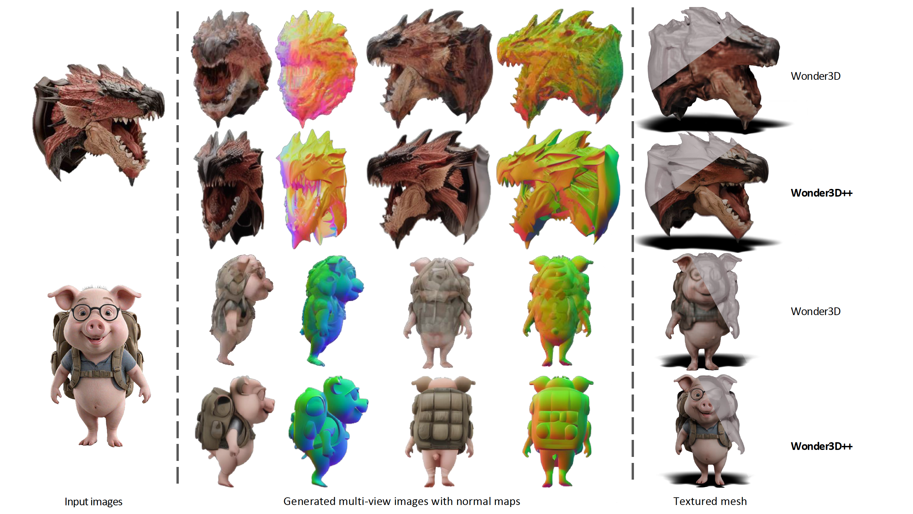

# Wonder3D -> Wonder3D++
Single Image to 3D using Cross-Domain Diffusion (CVPR 2024 Highlight).

Now extent to **Wonder3D++**!
## [Paper](https://arxiv.org/abs/2310.15008) | [Project page](https://www.xxlong.site/Wonder3D/) | [Hugging Face Demo](https://huggingface.co/spaces/flamehaze1115/Wonder3D-demo) | [Colab from @camenduru](https://github.com/camenduru/Wonder3D-colab)



Wonder3D++ reconstructs highly-detailed textured meshes from a single-view image in only 3 minutes. Wonder3D++ first generates consistent multi-view normal maps with corresponding color images via a **cross-domain diffusion model** and then leverages a **cascaded 3D mesh extraction** method to achieve fast and high-quality reconstruction.

## Collaborations
Our overarching mission is to enhance the speed, affordability, and quality of 3D AIGC, making the creation of 3D content accessible to all. While significant progress has been achieved in the recent years, we acknowledge there is still a substantial journey ahead. We enthusiastically invite you to engage in discussions and explore potential collaborations in any capacity. <span style="color:red">**If you're interested in connecting or partnering with us, please don't hesitate to reach out via email (xxlong@connect.hku.hk)**</span> .

## News
- 2024.12.22 **<span style="color:red">We have extent the [Wonder3D] to a more advanced version, [Wonder3D++]!</span>**.
- 2024.08.29 Fixed an issue in '/mvdiffusion/pipelines/pipeline_mvdiffusion_image' where cross-domain attention did not work correctly during classifier-free guidance (CFG) inference, causing misalignment between the RGB and normal generation results. To address this issue, we need to place the RGB and normal domain inputs in the first and second halves of the batch, respectively, before feeding them into the model. This approach differs from the typical CFG method, which separates unconditional and conditional inputs into the first and second halves of the batch.
- 2024.05.29 We release a more powerful MV cross-domain diffusion model [Era3D](https://github.com/pengHTYX/Era3D) that jointly produces 512x512 color images and normal maps, but more importantly Era3D could automatically figure out the focal length and elevation degree of the input image so that avoid geometry distortions.
- 2024.05.24 We release a large 3D native diffusion model [CraftsMan3D](https://github.com/wyysf-98/CraftsMan) that is directly trained on 3D representation and therefore is capable of producing complex structures.
- Fixed a severe training bug. The "zero_init_camera_projection" in 'configs/train/stage1-mix-6views-lvis.yaml' should be False. Otherwise, the domain control and pose control will be invalid in the training.
- 2024.03.19 Checkout our new model [GeoWizard](https://github.com/fuxiao0719/GeoWizard) that jointly produces depth and normal with high fidelity from single images.
- 2024.02 We release the training codes. Welcome to train wonder3D on your personal data.
- 2023.10 We release the inference model and codes.


### Preparation for inference

#### Linux System Setup.
```angular2html
conda create -n wonder3d_plus python=3.10
conda activate wonder3d_plus
pip install -r requirements.txt
```

### Prepare the training data
see [render_codes/README.md](render_codes/README.md).

### Training
Here we provide two training scripts `train_mvdiffusion_mixed.py` and `train_mvdiffusion_joint.py`. 

Our **Multi-Stage Training Scheme** training has three stages: 
1) We initially remove the domain switcher and cross-domain attention layers, modifying only the self-attention layers into a multi-view design;
2) We introduce the domain switcher, fine-tuning the model to generate either multi-view colors or normals from a single-view color image, guided by the domain switcher;
3) We add cross-domain attention modules into the SD model, and only optimize the newly added parameters.

You need to modify `root_dir` that contain the data of the config files `configs/train/stage1-mix-6views-lvis.yaml` and `configs/train/stage2-joint-6views-lvis.yaml` accordingly.

```
# stage 1:
accelerate launch --config_file 8gpu.yaml train_mvdiffusion_mixed.py --config configs/train/stage1-mixed-wo-switcher.yaml

# stage 2:
accelerate launch --config_file 8gpu.yaml train_mvdiffusion_mixed.py --config configs/train/stage1-mixed-6views-image-normal.yaml

# stage 3:
accelerate launch --config_file 8gpu.yaml train_mvdiffusion_joint_stage3.py --config configs/train/stage3-joint-6views-image-normal.yaml
```

To train our multi-view enhancement module:
```
accelerate launch --config_file 8gpu.yaml train_controlnet.py  --config configs/train-controlnet/mv_controlnet_train_joint.yaml
```

### Inference
1. Make sure you have downloaded the following models.
```bash
Wonder3D_plus
|-- ckpts
    |-- mvdiffusion
    |-- mv_controlnett
    |-- scheduler
    |-- vae
    ...
```
You also can download the model in python script:
```bash
from huggingface_hub import snapshot_download
snapshot_download(repo_id='flamehaze1115/Wonder3D_plus', local_dir="./ckpts")
```
2. [Optional] Download the [SAM](https://huggingface.co/spaces/abhishek/StableSAM/blob/main/sam_vit_h_4b8939.pth) model. Put it to the ``sam_pt`` folder.
Wonder3D_plus
```
|-- sam_pt
    |-- sam_vit_h_4b8939.pth
```
3. Predict foreground mask as the alpha channel. We use [Clipdrop](https://clipdrop.co/remove-background) to segment the foreground object interactively. 
You may also use `rembg` to remove the backgrounds.
```bash
# !pip install rembg
import rembg
result = rembg.remove(result)
result.show()
```
4. Run Wonder3d++ in a end2end manner. Then you can check the results in the folder `./outputs`. (we use `rembg` to remove backgrounds of the results, but the segmentations are not always perfect. May consider using [Clipdrop](https://clipdrop.co/remove-background) to get masks for the generated normal maps and color images, since the quality of masks will significantly influence the reconstructed mesh quality.) 
```bash
python run.py  --input_path {Path to input image or directory}\
            --output_path {Your output_path} \
            --crop_size {Default to 192. Crop size of the input image, this is a relative num that assume the resolution of input image is 256.} \
            --camera_type {The projection_type of input image, choose from 'ortho' and 'persp'.}
            --num_refine {Number of iterative refinement, default to 2.}
```

see example:

```bash
python run.py --input_path example_images/owl.png \
--camera_type ortho \
--output_path outputs 
```

## Acknowledgement
We have intensively borrow codes from the following repositories. Many thanks to the authors for sharing their codes.
- [stable diffusion](https://github.com/CompVis/stable-diffusion)
- [Era3D](https://github.com/pengHTYX/Era3D)
- [Unique3D](https://github.com/AiuniAI/Unique3D)
- [SyncDreamer](https://github.com/liuyuan-pal/SyncDreamer)
- [continuous-remeshing](https://github.com/Profactor/continuous-remeshing)

## License
Wonder3D++ and Wonder3D is under [AGPL-3.0](https://www.gnu.org/licenses/agpl-3.0.en.html), so any downstream solution and products (including cloud services) that include wonder3d code or a trained model (both pretrained or custom trained) inside it should be open-sourced to comply with the AGPL conditions. If you have any questions about the usage of Wonder3D++, please contact us first.
