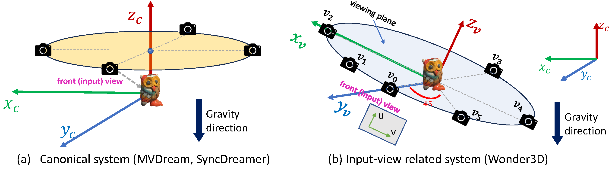

**中文版本 [中文](README_zh.md)**
# Wonder3D
Single Image to 3D using Cross-Domain Diffusion (CVPR 2024 Highlight)
## [Paper](https://arxiv.org/abs/2310.15008) | [Project page](https://www.xxlong.site/Wonder3D/) | [Hugging Face Demo](https://huggingface.co/spaces/flamehaze1115/Wonder3D-demo) | [Colab from @camenduru](https://github.com/camenduru/Wonder3D-colab)


Wonder3D reconstructs highly-detailed textured meshes from a single-view image in only 2 ∼ 3 minutes. Wonder3D first generates consistent multi-view normal maps with corresponding color images via a cross-domain diffusion model, and then leverages a novel normal fusion method to achieve fast and high-quality reconstruction.

## News
- Fixed a severe training bug. The "zero_init_camera_projection" in 'configs/train/stage1-mix-6views-lvis.yaml' should be False. Otherwise, the domain control and pose control will be invalid in the training.
- 2024.03.19 Checkout our new model [GeoWizard](https://github.com/fuxiao0719/GeoWizard) that jointly produces depth and normal with high fidelity from single images.
- 2024.05.24 We release a large 3D native diffusion model [CraftsMan3D](https://github.com/wyysf-98/CraftsMan) that is directly trained on 3D representation and therefore is capable of producing complex structures.
- 2024.05.29 We release a more powerful MV cross-domain diffusion model [Era3D](https://github.com/pengHTYX/Era3D) that jointly produces 512x512 color images and normal maps, but more importantly Era3D could automatically figure out the focal length and elevation degree of the input image so that avoid geometry distortions.

## Usage
```bash

# First clone the repo, and use the commands in the repo

import torch
import requests
from PIL import Image
import numpy as np
from torchvision.utils import make_grid, save_image
from diffusers import DiffusionPipeline  # only tested on diffusers[torch]==0.19.3, may have conflicts with newer versions of diffusers

def load_wonder3d_pipeline():

    pipeline = DiffusionPipeline.from_pretrained(
    'flamehaze1115/wonder3d-v1.0', # or use local checkpoint './ckpts'
    custom_pipeline='flamehaze1115/wonder3d-pipeline',
    torch_dtype=torch.float16
    )

    # enable xformers
    pipeline.unet.enable_xformers_memory_efficient_attention()

    if torch.cuda.is_available():
        pipeline.to('cuda:0')
    return pipeline

pipeline = load_wonder3d_pipeline()

# Download an example image.
cond = Image.open(requests.get("https://d.skis.ltd/nrp/sample-data/lysol.png", stream=True).raw)

# The object should be located in the center and resized to 80% of image height.
cond = Image.fromarray(np.array(cond)[:, :, :3])

# Run the pipeline!
images = pipeline(cond, num_inference_steps=20, output_type='pt', guidance_scale=1.0).images

result = make_grid(images, nrow=6, ncol=2, padding=0, value_range=(0, 1))

save_image(result, 'result.png')
```

## Collaborations
Our overarching mission is to enhance the speed, affordability, and quality of 3D AIGC, making the creation of 3D content accessible to all. While significant progress has been achieved in the recent years, we acknowledge there is still a substantial journey ahead. We enthusiastically invite you to engage in discussions and explore potential collaborations in any capacity. <span style="color:red">**If you're interested in connecting or partnering with us, please don't hesitate to reach out via email (xxlong@connect.hku.hk)**</span> .

## News

- 2024.02 We release the training codes. Welcome to train wonder3D on your personal data.
- 2023.10 We release the inference model and codes.


### Preparation for inference

#### Linux System Setup.
```angular2html
conda create -n wonder3d
conda activate wonder3d
pip install -r requirements.txt
pip install git+https://github.com/NVlabs/tiny-cuda-nn/#subdirectory=bindings/torch
```
#### Windows System Setup.

Please switch to branch `main-windows` to see details of windows setup.

#### Docker Setup
see [docker/README.MD](docker/README.md)

### Training
Here we provide two training scripts `train_mvdiffusion_image.py` and `train_mvdiffusion_joint.py`. 

The training has two stages: 1) first train multi-view attentions by randomly taking normal or color flag; 2) add cross-domain attention modules into the SD model, and only optimize the newly added parameters.

You need to modify `root_dir` that contain the data of the config files `configs/train/stage1-mix-6views-lvis.yaml` and `configs/train/stage2-joint-6views-lvis.yaml` accordingly.

```
# stage 1:
accelerate launch --config_file 8gpu.yaml train_mvdiffusion_image.py --config configs/train/stage1-mix-6views-lvis.yaml

# stage 2
accelerate launch --config_file 8gpu.yaml train_mvdiffusion_joint.py --config configs/train/stage2-joint-6views-lvis.yaml
```

### Prepare the training data
see [render_codes/README.md](render_codes/README.md).

### Inference
1. Optional. If you have troubles to connect to huggingface. Make sure you have downloaded the following models.
Download the [checkpoints](https://connecthkuhk-my.sharepoint.com/:f:/g/personal/xxlong_connect_hku_hk/Ej7fMT1PwXtKvsELTvDuzuMBebQXEkmf2IwhSjBWtKAJiA) and into the root folder.

If you are in mainland China, you may download via [aliyun](https://www.alipan.com/s/T4rLUNAVq6V).

```bash
Wonder3D
|-- ckpts
    |-- unet
    |-- scheduler
    |-- vae
    ...
```
Then modify the file ./configs/mvdiffusion-joint-ortho-6views.yaml, set `pretrained_model_name_or_path="./ckpts"`

2. Download the [SAM](https://huggingface.co/spaces/abhishek/StableSAM/blob/main/sam_vit_h_4b8939.pth) model. Put it to the ``sam_pt`` folder.
```
Wonder3D
|-- sam_pt
    |-- sam_vit_h_4b8939.pth
```
3. Predict foreground mask as the alpha channel. We use [Clipdrop](https://clipdrop.co/remove-background) to segment the foreground object interactively. 
You may also use `rembg` to remove the backgrounds.
```bash
# !pip install rembg
import rembg
result = rembg.remove(result)
result.show()
```
4. Run Wonder3d to produce multiview-consistent normal maps and color images. Then you can check the results in the folder `./outputs`. (we use `rembg` to remove backgrounds of the results, but the segmentations are not always perfect. May consider using [Clipdrop](https://clipdrop.co/remove-background) to get masks for the generated normal maps and color images, since the quality of masks will significantly influence the reconstructed mesh quality.) 
```bash
accelerate launch --config_file 1gpu.yaml test_mvdiffusion_seq.py \
            --config configs/mvdiffusion-joint-ortho-6views.yaml validation_dataset.root_dir={your_data_path} \
            validation_dataset.filepaths=['your_img_file'] save_dir={your_save_path}
```

see example:

```bash
accelerate launch --config_file 1gpu.yaml test_mvdiffusion_seq.py \
            --config configs/mvdiffusion-joint-ortho-6views.yaml validation_dataset.root_dir=./example_images \
            validation_dataset.filepaths=['owl.png'] save_dir=./outputs
```

#### Interactive inference: run your local gradio demo. (Only generate normals and colors without reconstruction)
```bash
python gradio_app_mv.py   # generate multi-view normals and colors
```

5. Mesh Extraction

#### Instant-NSR Mesh Extraction

```bash
cd ./instant-nsr-pl
python launch.py --config configs/neuralangelo-ortho-wmask.yaml --gpu 0 --train dataset.root_dir=../{your_save_path}/cropsize-{crop_size}-cfg{guidance_scale:.1f}/ dataset.scene={scene}
```

see example:

```bash
cd ./instant-nsr-pl
python launch.py --config configs/neuralangelo-ortho-wmask.yaml --gpu 0 --train dataset.root_dir=../outputs/cropsize-192-cfg1.0/ dataset.scene=owl
```

Our generated normals and color images are defined in orthographic views, so the reconstructed mesh is also in orthographic camera space. If you use MeshLab to view the meshes, you can click `Toggle Orthographic Camera` in `View` tab.

#### Interactive inference: run your local gradio demo. (First generate normals and colors, and then do reconstructions. No need to perform gradio_app_mv.py first.)
```bash
python gradio_app_recon.py   
```

#### NeuS-based Mesh Extraction

Since there are many complaints about the Windows setup of instant-nsr-pl, we provide the NeuS-based reconstruction, which may get rid of the requirement problems. 

NeuS consumes less GPU memory and favors smooth surfaces without parameters tuning. However, NeuS consumes more times and its texture may be less sharp. If you are not sensitive to time, we recommend NeuS for optimization due to its robustness.

```bash
cd ./NeuS
bash run.sh output_folder_path scene_name 
```

## Common questions
Q: Tips to get better results.
1. Wonder3D is sensitive the facing direciton of input images. By experiments, front-facing images always lead to good reconstruction.
2. Limited by resources, current implemetation only supports limited views (6 views) and low resolution (256x256). Any images will be first resized into 256x256 for generation, so images after such a downsample that still keep clear and sharp features will lead to good results.
3. Images with occlusions will cause worse reconstructions, since 6 views cannot cover the complete object. Images with less occlsuions lead to better results.
4. Increate optimization steps in instant-nsr-pl, modify `trainer.max_steps: 3000` in `instant-nsr-pl/configs/neuralangelo-ortho-wmask.yaml` to more steps like `trainer.max_steps: 10000`. Longer optimization leads to better texture.

Q: The evelation and azimuth degrees of the generated views?

A: Unlike that the prior works such as Zero123, SyncDreamer and One2345 adopt object world system, our views are defined in the camera system of the input image. The six views are in the plane with 0 elevation degree in the camera system of the input image. Therefore we don't need to estimate an elevation degree for input image. The azimuth degrees of the six views are 0, 45, 90, 180, -90, -45 respectively.

Q: The focal length of the generated views?

A: We assume the input images are captured by orthographic camera, so the generated views are also in orthographic space. This design enables our model to keep strong generlaization on unreal images, but sometimes it may suffer from focal lens distortions on real-captured images.

## Details about the camera system and camera poses

In practice, the target object is assumed to be placed along the gravity direction.
1) **Canonical coordinate system.** Some prior works (e.g. MVDream and SyncDreamer) adopt a shared canonical system for all objects, whose axis $Z_c$ shares the same direction with gravity (a). 
2) **Input view related system.** Wonder3D adopts an independent coordinate system for each object that is related to the input view.
Its $Z_v$ and $X_v$ axes are aligned with the UV dimension of 2D input image space, and its $Y_v$ axis is vertical to the 2D image plane and passes through the center of ROI (Region of Interests) (b).
3) **Camera poses.** Wonder3D outputs 6 views $\{v_i, i=0,...,5\}$ that are sampled at the $X_vOY_v$ plane of the input-view related system with a fixed radius, where the front view $v_0$ is initialized as input view and the other views are sampled with pre-defined azimuth degrees (see (b)).

## Acknowledgement
We have intensively borrow codes from the following repositories. Many thanks to the authors for sharing their codes.
- [stable diffusion](https://github.com/CompVis/stable-diffusion)
- [zero123](https://github.com/cvlab-columbia/zero123)
- [NeuS](https://github.com/Totoro97/NeuS)
- [SyncDreamer](https://github.com/liuyuan-pal/SyncDreamer)
- [instant-nsr-pl](https://github.com/bennyguo/instant-nsr-pl)

## License
Wonder3D is under [AGPL-3.0](https://www.gnu.org/licenses/agpl-3.0.en.html), so any downstream solution and products (including cloud services) that include wonder3d code or a trained model (both pretrained or custom trained) inside it should be open-sourced to comply with the AGPL conditions. If you have any questions about the usage of Wonder3D, please contact us first.

## Citation
If you find this repository useful in your project, please cite the following work. :)
```
@article{long2023wonder3d,
  title={Wonder3D: Single Image to 3D using Cross-Domain Diffusion},
  author={Long, Xiaoxiao and Guo, Yuan-Chen and Lin, Cheng and Liu, Yuan and Dou, Zhiyang and Liu, Lingjie and Ma, Yuexin and Zhang, Song-Hai and Habermann, Marc and Theobalt, Christian and others},
  journal={arXiv preprint arXiv:2310.15008},
  year={2023}
}
```
