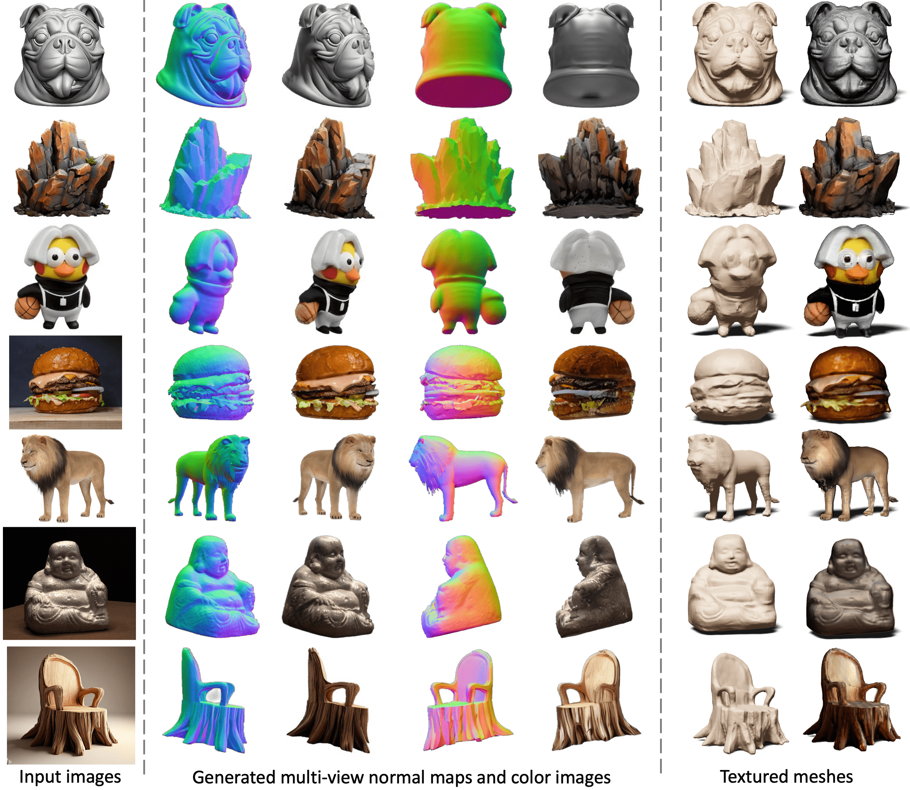

**其他语言版本 [English](README.md)**

# Wonder3D
Single Image to 3D using Cross-Domain Diffusion
## [Paper](https://arxiv.org/abs/2310.15008) | [Project page](https://www.xxlong.site/Wonder3D/) | [Hugging Face Demo](https://huggingface.co/spaces/flamehaze1115/Wonder3D-demo) | [Colab from @camenduru](https://github.com/camenduru/Wonder3D-colab)



Wonder3D仅需2至3分钟即可从单视图图像中重建出高度详细的纹理网格。Wonder3D首先通过跨域扩散模型生成一致的多视图法线图与相应的彩色图像，然后利用一种新颖的法线融合方法实现快速且高质量的重建。

## Usage 使用
```bash

import torch
import requests
from PIL import Image
import numpy as np
from torchvision.utils import make_grid, save_image
from diffusers import DiffusionPipeline  # only tested on diffusers[torch]==0.19.3, may have conflicts with newer versions of diffusers

def load_wonder3d_pipeline():

    pipeline = DiffusionPipeline.from_pretrained(
    'flamehaze1115/wonder3d-v1.0', # or use local checkpoint './ckpts'
    custom_pipeline='flamehaze1115/wonder3d-pipeline',
    torch_dtype=torch.float16
    )

    # enable xformers
    pipeline.unet.enable_xformers_memory_efficient_attention()

    if torch.cuda.is_available():
        pipeline.to('cuda:0')
    return pipeline

pipeline = load_wonder3d_pipeline()

# Download an example image.
cond = Image.open(requests.get("https://d.skis.ltd/nrp/sample-data/lysol.png", stream=True).raw)

# The object should be located in the center and resized to 80% of image height.
cond = Image.fromarray(np.array(cond)[:, :, :3])

# Run the pipeline!
images = pipeline(cond, num_inference_steps=20, output_type='pt', guidance_scale=1.0).images

result = make_grid(images, nrow=6, ncol=2, padding=0, value_range=(0, 1))

save_image(result, 'result.png')
```

## Collaborations 合作
我们的总体使命是提高3D人工智能图形生成（3D AIGC）的速度、可负担性和质量，使所有人都能够轻松创建3D内容。尽管近年来取得了显著的进展，我们承认前方仍有很长的路要走。我们热切邀请您参与讨论并在任何方面探索潜在的合作机会。<span style="color:red">**如果您有兴趣与我们联系或合作，请随时通过电子邮件（xxlong@connect.hku.hk）联系我们**</span>。

## More features 

The repo is still being under construction, thanks for your patience. 
- [x] Local gradio demo.
- [x] Detailed tutorial.
- [x] GUI demo for mesh reconstruction
- [x] Windows support
- [x] Docker support

## Schedule
- [x] Inference code and pretrained models.
- [x] Huggingface demo.
- [ ] New model with higher resolution.


### Preparation for inference 测试准备

#### Linux System Setup.
```angular2html
conda create -n wonder3d
conda activate wonder3d
pip install -r requirements.txt
pip install git+https://github.com/NVlabs/tiny-cuda-nn/#subdirectory=bindings/torch
```
#### Windows System Setup.

请切换到`main-windows`分支以查看Windows设置的详细信息。

#### Docker Setup
详见 [docker/README.MD](docker/README.md)

### Inference
1. 可选。如果您在连接到Hugging Face时遇到问题，请确保已下载以下模型。
下载[checkpoints](https://connecthkuhk-my.sharepoint.com/:f:/g/personal/xxlong_connect_hku_hk/Ej7fMT1PwXtKvsELTvDuzuMBebQXEkmf2IwhSjBWtKAJiA)并放入根文件夹中。

国内用户可下载： [阿里云盘](https://www.alipan.com/s/T4rLUNAVq6V)

```bash
Wonder3D
|-- ckpts
    |-- unet
    |-- scheduler
    |-- vae
    ...
```
然后更改文件 ./configs/mvdiffusion-joint-ortho-6views.yaml, 设置 `pretrained_model_name_or_path="./ckpts"`

2. 下载模型 [SAM](https://huggingface.co/spaces/abhishek/StableSAM/blob/main/sam_vit_h_4b8939.pth) . 放置在 ``sam_pt`` 文件夹.
```
Wonder3D
|-- sam_pt
    |-- sam_vit_h_4b8939.pth
```
3. 预测前景蒙版作为阿尔法通道。我们使用[Clipdrop](https://clipdrop.co/remove-background)来交互地分割前景对象。
您还可以使用`rembg`来去除背景。
```bash
# !pip install rembg
import rembg
result = rembg.remove(result)
result.show()
```
4. 运行Wonder3D以生成多视角一致的法线图和彩色图像。然后，您可以在文件夹`./outputs`中检查结果（我们使用`rembg`去除结果的背景，但分割并不总是完美的。可以考虑使用[Clipdrop](https://clipdrop.co/remove-background)获取生成的法线图和彩色图像的蒙版，因为蒙版的质量将显著影响重建的网格质量）。
```bash
accelerate launch --config_file 1gpu.yaml test_mvdiffusion_seq.py \
            --config configs/mvdiffusion-joint-ortho-6views.yaml validation_dataset.root_dir={your_data_path} \
            validation_dataset.filepaths=['your_img_file'] save_dir={your_save_path}
```

示例:

```bash
accelerate launch --config_file 1gpu.yaml test_mvdiffusion_seq.py \
            --config configs/mvdiffusion-joint-ortho-6views.yaml validation_dataset.root_dir=./example_images \
            validation_dataset.filepaths=['owl.png'] save_dir=./outputs
```

#### 运行本地的Gradio演示。仅生成法线和颜色，无需进行重建。
```bash
python gradio_app_mv.py   # generate multi-view normals and colors
```

5. Mesh Extraction

#### Instant-NSR Mesh Extraction

```bash
cd ./instant-nsr-pl
python launch.py --config configs/neuralangelo-ortho-wmask.yaml --gpu 0 --train dataset.root_dir=../{your_save_path}/cropsize-{crop_size}-cfg{guidance_scale:.1f}/ dataset.scene={scene}
```

示例:

```bash
cd ./instant-nsr-pl
python launch.py --config configs/neuralangelo-ortho-wmask.yaml --gpu 0 --train dataset.root_dir=../outputs/cropsize-192-cfg1.0/ dataset.scene=owl
```

我们生成的法线图和彩色图像是在正交视图中定义的，因此重建的网格也处于正交摄像机空间。如果您使用MeshLab查看网格，可以在“View”选项卡中单击“Toggle Orthographic Camera”切换到正交相机。

#### 运行本地的Gradio演示。首先生成法线和颜色，然后进行重建。无需首先执行`gradio_app_mv.py`。
```bash
python gradio_app_recon.py   
```

#### NeuS-based Mesh Extraction

由于许多用户对于instant-nsr-pl的Windows设置提出了抱怨，我们提供了基于NeuS的重建，这可能消除了一些要求方面的问题。

NeuS消耗较少的GPU内存，对平滑表面有利，无需参数调整。然而，NeuS需要更多时间，其纹理可能不够清晰。如果您对时间不太敏感，我们建议由于其稳健性而使用NeuS进行优化。

```bash
cd ./NeuS
bash run.sh output_folder_path scene_name 
```

## 常见问题
**获取更好结果的提示:**
1. **图片朝向方向敏感:** Wonder3D对输入图像的面向方向敏感。通过实验证明，面向前方的图像通常会导致良好的重建结果。
2. **图像分辨率:** 受资源限制，当前实现仅支持有限的视图（6个视图）和低分辨率（256x256）。任何图像都将首先调整大小为256x256进行生成，因此在这样的降采样后仍然保持清晰而锐利特征的图像将导致良好的结果。
3. **处理遮挡:** 具有遮挡的图像会导致更差的重建，因为6个视图无法完全覆盖整个对象。具有较少遮挡的图像通常会产生更好的结果。
4. **增加instant-nsr-pl中的优化步骤:** 在instant-nsr-pl中增加优化步骤。在`instant-nsr-pl/configs/neuralangelo-ortho-wmask.yaml`中修改`trainer.max_steps: 3000`为更多步骤，例如`trainer.max_steps: 10000`。更长的优化步骤会导致更好的纹理。

**生成视图信息:**
- **仰角和方位角度:** 与Zero123、SyncDreamer和One2345等先前作品采用对象世界系统不同，我们的视图是在输入图像的相机系统中定义的。六个视图在输入图像的相机系统中的平面上，仰角为0度。因此，我们不需要为输入图像估算仰角。六个视图的方位角度分别为0、45、90、180、-90、-45。

**生成视图的焦距:**
- 我们假设输入图像是由正交相机捕获的，因此生成的视图也在正交空间中。这种设计使得我们的模型能够在虚构图像上保持强大的泛化能力，但有时可能在实际捕获的图像上受到焦距镜头畸变的影响。

## 致谢
We have intensively borrow codes from the following repositories. Many thanks to the authors for sharing their codes.
- [stable diffusion](https://github.com/CompVis/stable-diffusion)
- [zero123](https://github.com/cvlab-columbia/zero123)
- [NeuS](https://github.com/Totoro97/NeuS)
- [SyncDreamer](https://github.com/liuyuan-pal/SyncDreamer)
- [instant-nsr-pl](https://github.com/bennyguo/instant-nsr-pl)

## 协议
Wonder3D采用[AGPL-3.0](https://www.gnu.org/licenses/agpl-3.0.en.html)许可，因此任何包含Wonder3D代码或其中训练的模型（无论是预训练还是定制训练）的下游解决方案和产品（包括云服务）都应该开源以符合AGPL条件。如果您对Wonder3D的使用有任何疑问，请首先与我们联系。

## 引用
如果您在项目中发现这个项目对您有用，请引用以下工作。 :)
```
@article{long2023wonder3d,
  title={Wonder3D: Single Image to 3D using Cross-Domain Diffusion},
  author={Long, Xiaoxiao and Guo, Yuan-Chen and Lin, Cheng and Liu, Yuan and Dou, Zhiyang and Liu, Lingjie and Ma, Yuexin and Zhang, Song-Hai and Habermann, Marc and Theobalt, Christian and others},
  journal={arXiv preprint arXiv:2310.15008},
  year={2023}
}
```
